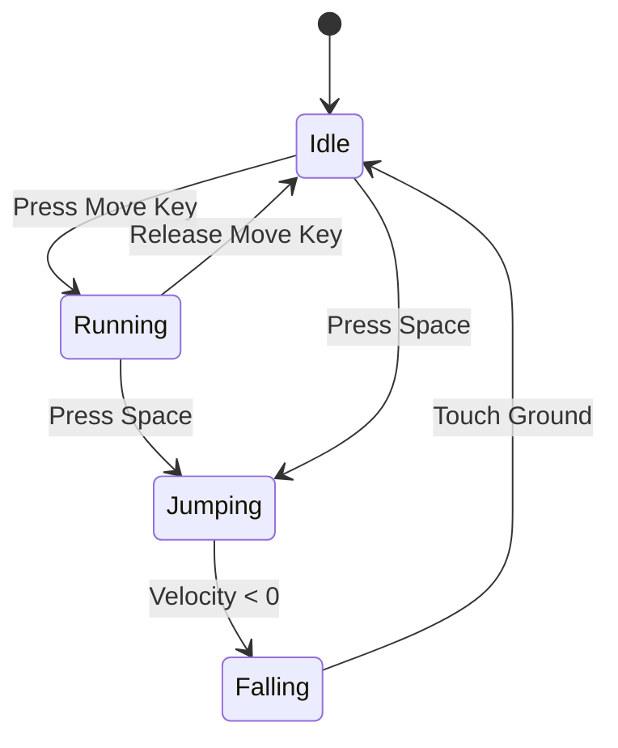
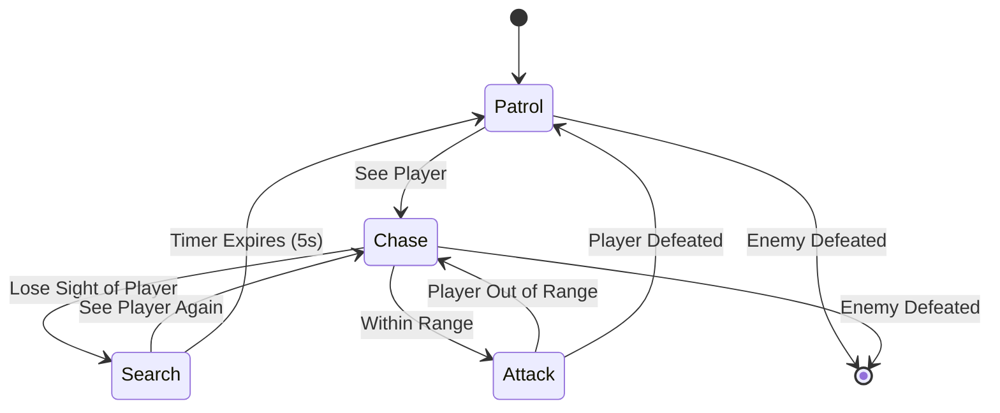

# Finite State Machines (FSM)

## 1. The Summary: What is a State Machine?
In game development, a **Finite State Machine (FSM)** is a design pattern used to manage an object's behavior. It is essentially a "brain" that follows a specific flowchart. 

An object in an FSM can only be in **one state at a time** (e.g., Idle, Running, or Jumping). To switch states, a specific **transition** (trigger) must occur.

---

### The Three Components:
1.  **States:** The specific behaviours (Idle, Attack, Dead).
2.  **Transitions:** The "paths" between states.
3.  **Inputs/Triggers:** The events that cause a transition (e.g., a button press, a timer, or a health value reaching zero).

---

## 2. Why use FSMs?
When we first learn how to program, we usually rely a lot on `if/else` statements. This is 100% the easiest way to begin making games, it becomes a nightmare as the scope of games grow, especially as you add more mechanics, or more details to mechanics.

| Feature | The "If-Else" Way (Spaghetti) | The FSM Way |
| :--- | :--- | :--- |
| **Clarity** | Code is tangled; hard to see "where" the player is logic-wise. | Logic is modular; "Jump" code stays in the "Jump" state. |
| **Bugs** | High risk of "Illegal States" (e.g., shooting while dead). | Impossible to be in two states at once. |
| **Scalability** | Adding a new feature requires rewriting old code. | Adding a new state (like 'Wall Slide') is like adding a new Lego brick. |
| **Debugging** | You have to track 20 variables to find a bug. | You just look at the current state to see what went wrong. |

---

## 3. Common Examples
<div style="display: flex; gap: 20px;" >

<div style="flex:1;" markdown="1">

### Example A: Platformer Player Character

This is the easiest way to visualize how animations and physics change based on state.
- **Idle State:** Play "Idle" animation; wait for input.
- **Run State:** Play "Run" animation; apply horizontal force.
- **Jump State:** Play "Upward" animation; apply vertical force; ignore ground-check.
- **Fall State:** Play "Falling" animation; enable ground-check to return to Idle.

</div>

<div style="flex:1;" markdown="1">


</div> </div>
---
<div style="display: flex; align-items: center; justify-content: center; gap: 40px; height: 100%;">

<div style="flex:1;" markdown="1">

### Example B: The Enemy Guard (AI)
This demonstrates how FSMs create the illusion of intelligence.
- **Patrol:** Moves between waypoints. 
    - *Trigger:* Sees player. $\rightarrow$ **Chase**
- **Chase:** Moves toward player coordinates. 
    - *Trigger:* Player lost for 3 seconds. $\rightarrow$ **Search**
    - *Trigger:* Player in range for attack $\rightarrow$ **Attack**
- **Search:** Rotates in place/looks around. 
    - *Trigger:* Timer expires. $\rightarrow$ **Patrol**
    - *Trigger:* Sees player. $\rightarrow$ **Chase**
- **Attack:** When in range of the player, attacks them 
	- *Trigger:* Player out of range for attacks $\rightarrow$ **Chase**
	- *Trigger:* Player lost for 3 seconds. $\rightarrow$ **Search**

</div>

<div style="flex:1;" markdown="1">



</div> </div>
---
<div style="display: flex; gap: 20px;" >

<div style="flex:1;" markdown="1">

### Left Side
- Item 1
- Item 2
- 
</div>

<div style="flex:1;" markdown="1">

### Right Side
Some text here

</div>

</div>
---

## 4. Implementing FSMs in Godot

### Method A: The "Node-Based" Pattern
In this approach, every state is a literal **Node** child of a "State Machine" parent. This is often a good choice because it keeps everything nice and visible in the editor.

* **How it works:** Each state is its own script file attached to a Node. The parent "State Machine" node handles the switching logic.
* **The Scene Tree Structure:**
    * `Knight` (CharacterBody2D)
        * `Sprite2D`
        * `StateMachine` (Node) — *The Knight AI script*
            * `Patrol` (Node) — *Attached: patrolState.gd*
            * `Chase` (Node) — *Attached: chaseState.gd*
            * `Search` (Node) — *Attached: searchState.gd*
            * `Attack` (Node) — *Attached: attackState.gd*

---

### Method B: The "Class-Based" Pattern
Instead of using the Scene Tree, states are loaded as scripts or resources directly into the main script's memory.

* **How it works:** The main script uses a `Dictionary` or `Array` to hold references to different state classes.
* **Pros:** Cleaner Scene Tree; slightly better performance for hundreds of enemies.
* **Cons:** A little harder to debug, and parts of the main StateMachine script look a little clunkier
---
## 5. What do States look like?
There's a generally accepted structure for what a state should look like, and it generally follows this structure:
```gdscript
extends Node

func enter():
    pass
    
func exit():
    pass

func physicsProcess(delta):
    pass
```
--- 
This structure is important for a few reasons;
- `enter` and `exit` functions handle the setup and cleanup for when you transition in and out of the states
	- Setting animations
	- Timer setup and closing
	- 
- The `physicsProcess` function is our standard "Update" function that runs once every physics frame 
	- Most of the functionality for the state lives in here, and handles what the object should be doing
		- Movement, attacks, etc.
		- If statements to see if it should change to another state
	- Sometimes you'll want a separate process function to run on the dynamic framerate